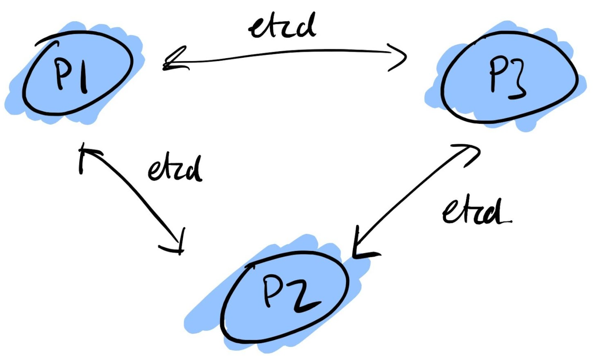
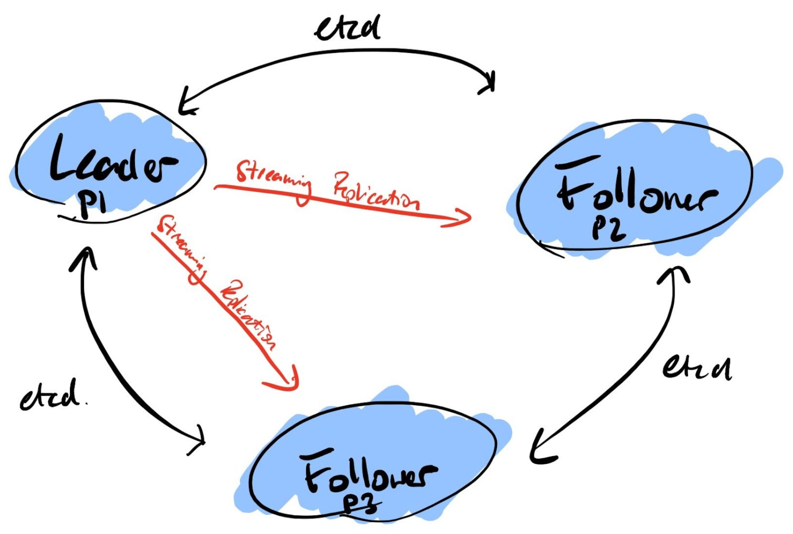
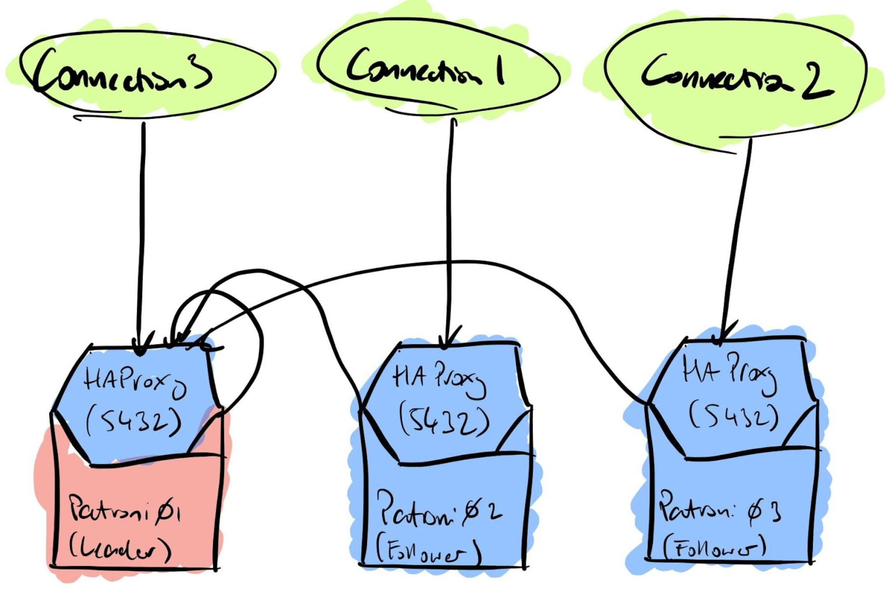
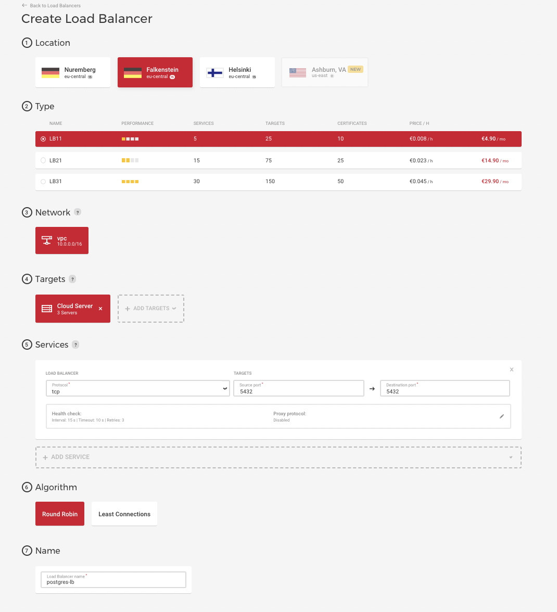
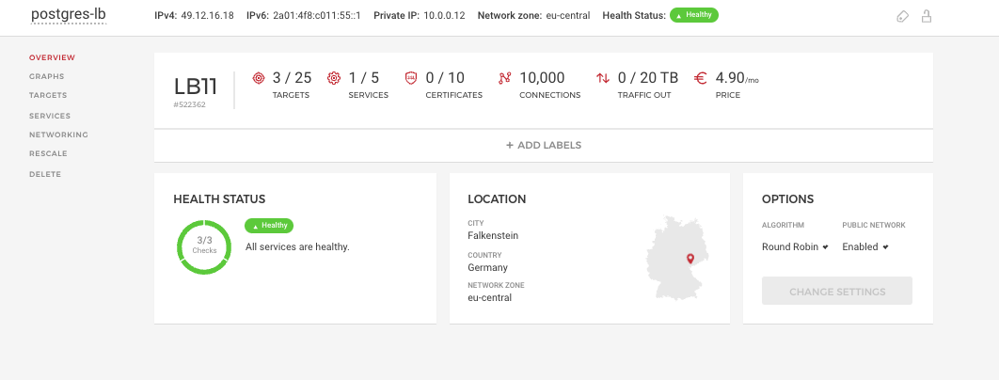
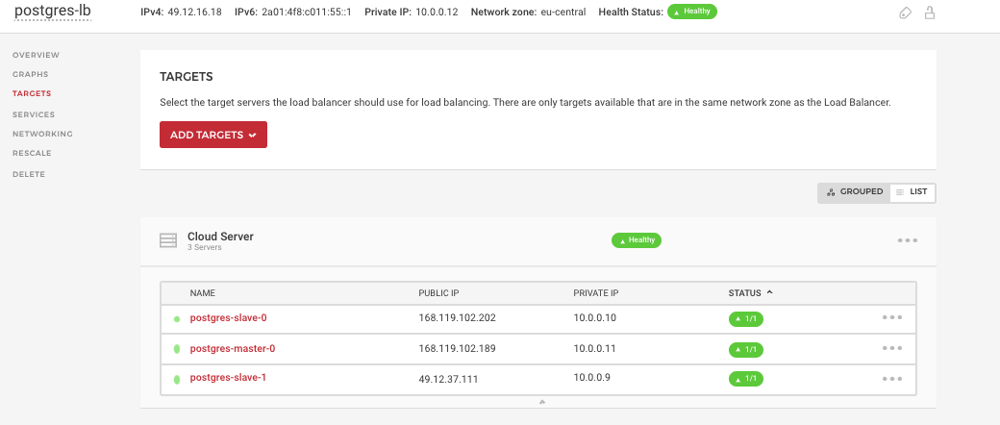

## PostgreSQL High-Availability Cluster by Patroni using ETCD cluster. Automating deployment with Terraform & Ansible.

- Patroni is a cluster manager used to customize and automate deployment and maintenance of PostgreSQL HA (High Availability) clusters. It uses distributed configuration stores like etcd, Consul, ZooKeeper or Kubernetes for maximum accessibility.

- etcd is a distributed reliable key-value store for the most critical data of a distributed system. etcd is written in Go and uses the Raft consensus algorithm to manage a highly-available replicated log. It is used by Patroni to store information about the status of the cluster and PostgreSQL configuration parameters.

- HAProxy is a free, very fast and reliable solution offering high availability, load balancing, and proxying for TCP and HTTP-based applications.

- Hetzner Load Balancers let you scale your applications easily by automatically distributing traffic across your infrastructure. Handle common use-cases (like TLS Termination) or create an internet-facing entry point to route traffic into your Hetzner Cloud Networks.

## Architecture overview:

Etcd three node cluster (DCS:Distributed Configuration Store):



When all the nodes are up and running:



HAProxy (OPTIONAL):




## Gitlab CI/CD

We have gitlab-ci for automating deployment (via IaC:terraform and CM: ansible)


## Manual Setup example

### Install needed software hcloud-cli/terraform/ansible on control node (laptop in this example)


```
Linux:

$ TER_VER=`curl -s https://api.github.com/repos/hashicorp/terraform/releases/latest | grep tag_name | cut -d: -f2 | tr -d \"\,\v | awk '{$1=$1};1'`
$ wget https://releases.hashicorp.com/terraform/${TER_VER}/terraform_${TER_VER}_linux_amd64.zip && unzip terraform_${TER_VER}_linux_amd64.zip && chmod +x terraform && sudo mv terraform /usr/local/bin/$ sudo apt update && apt install python3-pip sshpass git -y$ 
$ sudo pip3 install ansible
$ wget hcloud-linux-amd64.tar.gz && unzip hcloud-linux-amd64.tar.gz && chmod +x hcloud && sudo mv hcloud /usr/local/bin

Mac:

% brew tap hashicorp/tap
% brew install hashicorp/tap/terraform
% brew install ansible
% brew install hcloud
```
### Provision 3 Hetzner Cloud VMs with terraform for ansible testing:

```
$ cd ./infrastructure

# Setup hcloud_token

% export HCLOUD_TOKEN="XXXXXXXXXXXXXXX"

$ terraform init
$ terraform plan
$ terraform apply

### Hetzner dedicated-servers/VMs: get IPs for ansible inventory (using hcloud-cli or Hetzner web UI):

% hcloud server list

```

### Provisioning PostgreSQL HA Cluster:

Note: The cluster is configured with a single primary and two asynchronous streaming replica in this example:

```

% cd ./postgresql_cluster
### edit ansible inventory file (based on hcloud-cli output -> hcloud server list)  and run ansible playbook

% ansible-playbook -i ./inventory deploy_pgcluster.yml
### ssh to master and check cluster:

% ssh root@master_ip

# patronictl topology

Example:

root@postgres-master-0:~# patronictl topology
+--------------------+-----------+---------+---------+----+-----------+
| Member             | Host      | Role    | State   | TL | Lag in MB |
+ Cluster: postgres-cluster (7033705074649969684) ---+----+-----------+
| postgres-master-0  | 10.0.0.11 | Leader  | running |  1 |           |
| + postgres-slave-0 | 10.0.0.10 | Replica | running |  1 |         0 |
| + postgres-slave-1 | 10.0.0.9  | Replica | running |  1 |         0 |
+--------------------+-----------+---------+---------+----+-----------+


### Note: postgres user password: postgres-pass

# psql -h localhost -U postgres

```
### Postgres HA testing:

Power OFF Postgres master (via Hetzner web UI) ---> check Postgres HA cluster
```
root@postgres-slave-1:~# patronictl topology
2021-11-23 10:21:39,451 - ERROR - Failed to get list of machines from http://10.0.0.11:2379/v2: MaxRetryError("HTTPConnectionPool(host='10.0.0.11', port=2379): Max retries exceeded with url: /v2/machines (Caused by ConnectTimeoutError(<urllib3.connection.HTTPConnection object at 0x7f6a8602ce50>, 'Connection to 10.0.0.11 timed out. (connect timeout=1.6666666666666667)'))")
+--------------------+-----------+---------+---------+----+-----------+
| Member             | Host      | Role    | State   | TL | Lag in MB |
+ Cluster: postgres-cluster (7033705074649969684) ---+----+-----------+
| postgres-slave-1   | 10.0.0.9  | Leader  | running |  2 |           |
| + postgres-slave-0 | 10.0.0.10 | Replica | running |  2 |         0 |
+--------------------+-----------+---------+---------+----+-----------+
```

Power ON Postgres master (via Hetzner web UI) ----> check Postgres HA cluster

```
root@postgres-slave-1:~# patronictl topology
+---------------------+-----------+---------+---------+----+-----------+
| Member              | Host      | Role    | State   | TL | Lag in MB |
+ Cluster: postgres-cluster (7033705074649969684) ----+----+-----------+
| postgres-slave-1    | 10.0.0.9  | Leader  | running |  2 |           |
| + postgres-master-0 | 10.0.0.11 | Replica | running |  2 |         0 |
| + postgres-slave-0  | 10.0.0.10 | Replica | running |  2 |         0 |
+---------------------+-----------+---------+---------+----+-----------+
```

### HAProxy (OPTIONAL: PostgreSQL High-Availability with HAProxy Load Balancing. Note: We can use Hetzner Load Balancer also)

HAProxy Load Balancing setup via ansible (file: postgresql_cluster/vars/main.yml)
```
with_haproxy_load_balancing: true  # or 'true' if you want to install and configure the load-balancing
```

This setup provides the ability to distribute the load on reading and also allows us to scale out the cluster (with read-only replicas).

```
port 5000 (read / write) master
port 5001 (read only) all replicas
```

Note: Our applications have to be configured for sending read requests to a custom port (5001), and write requests (5000).

Example (snip)
```
TASK [deploy-finish : PostgreSQL Cluster connection info] **********************
ok: [10.0.0.11] => {
    "msg": [
        "+------------------------------------------------+",
        "address 10.0.0.11,10.0.0.10,10.0.0.9",
        "port 5000 (read/write) master",
        "port 5001 (read only)  all replicas",
        "+------------------------------------------------+"
    ]
}
...

root@postgres-master-0:~# psql -h 10.0.0.11 -p 5000 -U postgres
Password for user postgres: 
psql (13.5 (Ubuntu 13.5-2.pgdg20.04+1))
Type "help" for help.

postgres=# \q
root@postgres-master-0:~# psql -h 10.0.0.10 -p 5001 -U postgres
Password for user postgres: 
psql (13.5 (Ubuntu 13.5-2.pgdg20.04+1))
Type "help" for help.

postgres=# \q

### check host fw & haproxy
root@postgres-master-0:~# iptables -n -L -v
root@postgres-master-0:~# echo "show info;show stat" | nc -U /run/haproxy/admin.sock

```

Example HAProxy (external from cluster) configuration:

We need to have HAProxy to listen for connections on the PostgreSQL standard port 5432. Then HAProxy should check the patroni api to determine which node is the primary.

```
global
	maxconn 100

defaults
	log global
	mode tcp
	retries 2
	timeout client 30m
	timeout connect 4s
	timeout server 30m
	timeout check 5s

listen stats
	mode http
	bind *:7000
	stats enable
	stats uri /

listen region_one
	bind *:5432
	option httpchk
	http-check expect status 200
	default-server inter 3s fall 3 rise 2 on-marked-down shutdown-sessions
    	server patroni01 master_ip:6432 maxconn 80 check port 8008
    	server patroni02 slave1_ip:6432 maxconn 80 check port 8008
    	server patroni03 slave2_ip:6432 maxconn 80 check port 8008
```

### Hetzner Cloud Load Balancer (OPTIONAL: PostgreSQL High-Availability with Hetzner Cloud Load Balancing)

Create Hetzner Load Balancer:



Check Hetzner Load Balancer (summary & targets):





Example:
```
ADD hetzner LB private IP to all nodes (10.0.0.12) --> file: /etc/postgresql/13/main/pg_hba.conf

root@postgres-slave-1:/etc/postgresql/13/main# grep "10.0.0.12" pg_hba.conf 
  host      all                      all                      10.0.0.12/32         md5

root@postgres-slave-1:/etc/postgresql/13/main# patronictl topology
+---------------------+-----------+---------+---------+----+-----------+
| Member              | Host      | Role    | State   | TL | Lag in MB |
+ Cluster: postgres-cluster (7033705074649969684) ----+----+-----------+
| postgres-slave-1    | 10.0.0.9  | Leader  | running |  2 |           |
| + postgres-master-0 | 10.0.0.11 | Replica | running |  2 |         0 |
| + postgres-slave-0  | 10.0.0.10 | Replica | running |  2 |         0 |
+---------------------+-----------+---------+---------+----+-----------+

Restart postgres cluster members:

patronictl restart postgres-cluster postgres-slave-0
patronictl restart postgres-cluster postgres-slave-1
patronictl restart postgres-cluster postgres-master-0 


Test Hetzner LB (external access: public IP):

$ nc -z -v 49.12.16.18 5432
Connection to 49.12.16.18 port 5432 [tcp/postgresql] succeeded!

$ docker run -it --rm jbergknoff/postgresql-client -h 49.12.16.18 -U postgres
Password for user postgres: 
psql (12.3, server 13.5 (Ubuntu 13.5-2.pgdg20.04+1))
WARNING: psql major version 12, server major version 13.
         Some psql features might not work.
SSL connection (protocol: TLSv1.3, cipher: TLS_AES_256_GCM_SHA384, bits: 256, compression: off)
Type "help" for help.

postgres=# \l
                                  List of databases
   Name    |  Owner   | Encoding |   Collate   |    Ctype    |   Access privileges   
-----------+----------+----------+-------------+-------------+-----------------------
 postgres  | postgres | UTF8     | en_US.UTF-8 | en_US.UTF-8 | 
 template0 | postgres | UTF8     | en_US.UTF-8 | en_US.UTF-8 | =c/postgres          +
           |          |          |             |             | postgres=CTc/postgres
 template1 | postgres | UTF8     | en_US.UTF-8 | en_US.UTF-8 | =c/postgres          +
           |          |          |             |             | postgres=CTc/postgres
(3 rows)

postgres=# \q
```

